# Lista 10

## a) Utwórz zbiory: treningowy zawierający 80% danych oraz testowy zawierający 20% danych.

```R
# Ustawienie ziarna losowości dla powtarzalności wyników
set.seed(123)

# Podział danych na zbiór treningowy i testowy
splitIndex <- createDataPartition(wine_data$V1, p = 0.8, list = FALSE)
train_set <- wine_data[splitIndex, ]
test_set <- wine_data[-splitIndex, ]
```

## b) Zbuduj naiwny klasyfikator bayesowski (na zbiorze treningowym). Wyświetl rozkład klas dla zmiennej celu oraz listę tabel prawdopodobieństw warunkowych.

```R
# Budowanie naiwnego klasyfikatora bayesowskiego
nb_model <- naiveBayes(V1 ~ ., data = train_set)

# Wyświetlenie rozkładu klas zmiennej celu
print(nb_model$class)

# Wyświetlenie tabel prawdopodobieństw warunkowych dla każdej zmiennej
print(nb_model$tables)
```

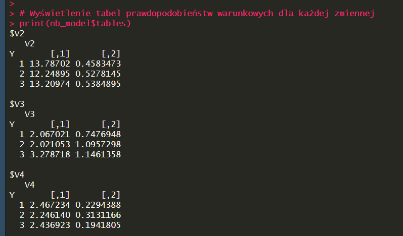
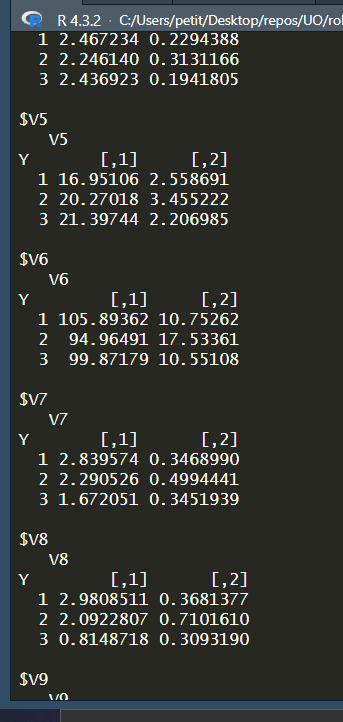
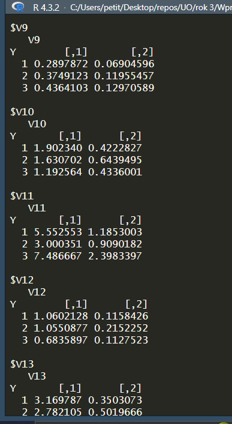


## c) Przeprowadź klasyfikację danych metodą naiwnego klasyfikatora bayesowskiego (na zbiorze testowym). Wyświetl macierz błędów.

```R
# Przewidywanie na zbiorze testowym
predictions <- predict(nb_model, test_set)

# Obliczenie i wyświetlenie macierzy błędów
confusionMatrix <- table(test_set$V1, predictions)
print(confusionMatrix)
```

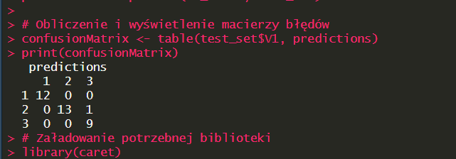

## d) Napisz, jaka jest dokładność klasyfikacji i współczynnik błędu

Na podstawie macierzy błędów można obliczyć dokładność klasyfikacji oraz współczynnik błędu. Dokładność klasyfikacji to stosunek liczby poprawnie sklasyfikowanych przypadków do całkowitej liczby przypadków, a współczynnik błędu to stosunek liczby błędnie sklasyfikowanych przypadków do całkowitej liczby przypadków.

Macierz błędów wygląda następująco:

```
   predictions
     1  2  3
  1 12  0  0
  2  0 13  1
  3  0  0  9
```

Obliczmy teraz dokładność i współczynnik błędu:

1. **Dokładność (Accuracy)**: Jest to `(poprawne przypisania klasy 1 + poprawne przypisania klasy 2 + poprawne przypisania klasy 3) / całkowita liczba przypadków`

   - W naszym przypadku: `(12 + 13 + 9) / (12 + 13 + 1 + 9)`

2. **Współczynnik błędu (Error Rate)**: Jest to `1 - dokładność`
   - Można to również obliczyć jako `(błędne przypisania) / całkowita liczba przypadków`

Obliczymy te wartości:

Dokładność klasyfikacji wynosi około \(97.14\%\) a współczynnik błędu to około \(2.86\%\). Oznacza to, że model naiwnego klasyfikatora bayesowskiego bardzo dobrze radzi sobie z klasyfikacją na zbiorze testowym.

## e) Zbuduj cztery modele SVM z różnymi funkcjami jądra: radialną, liniową, wielomianową i sigmoidalną (pamiętaj o standaryzacji danych).

```R
# Standaryzacja danych treningowych i testowych
train_set_standardized <- scale(train_set[, -1])
test_set_standardized <- scale(test_set[, -1], center = attr(train_set_standardized, "scaled:center"), scale = attr(train_set_standardized, "scaled:scale"))

# Dodanie kolumny z etykietami klasy do zbiorów danych
train_set_standardized <- data.frame(train_set$V1, train_set_standardized)
test_set_standardized <- data.frame(test_set$V1, test_set_standardized)
colnames(train_set_standardized)[1] <- "V1"
colnames(test_set_standardized)[1] <- "V1"

# Budowanie modeli SVM z różnymi funkcjami jądra
svm_radial <- svm(V1 ~ ., data = train_set_standardized, kernel = "radial")
svm_linear <- svm(V1 ~ ., data = train_set_standardized, kernel = "linear")
svm_polynomial <- svm(V1 ~ ., data = train_set_standardized, kernel = "polynomial")
svm_sigmoid <- svm(V1 ~ ., data = train_set_standardized, kernel = "sigmoid")

# Wyświetlenie informacji o modelach
summary(svm_radial)
summary(svm_linear)
summary(svm_polynomial)
summary(svm_sigmoid)
```

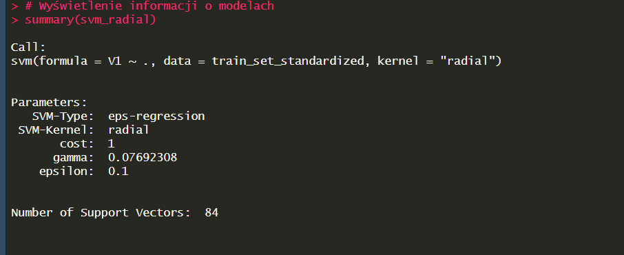
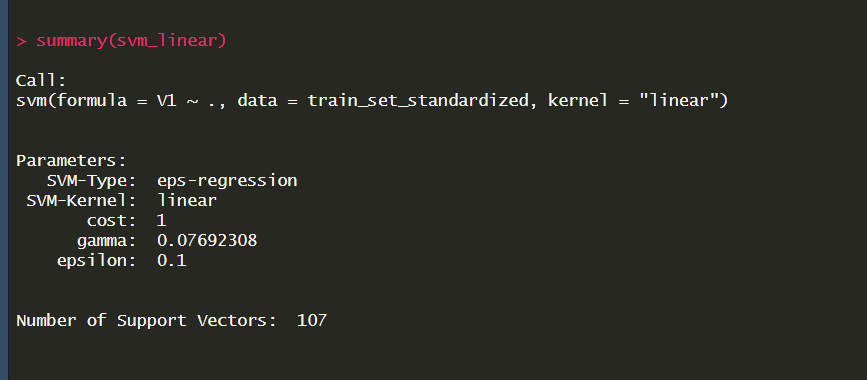
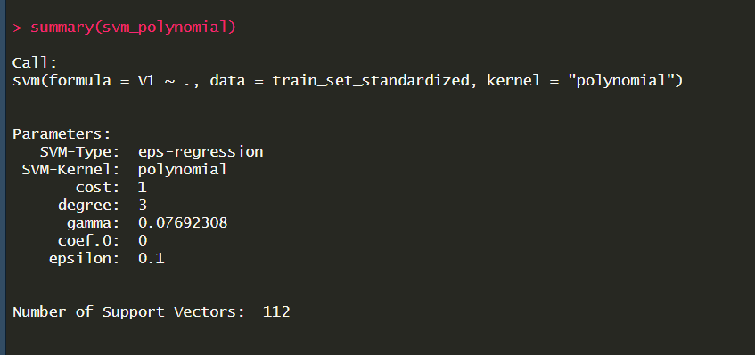
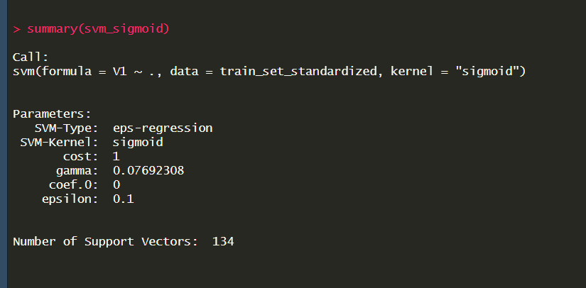

## f) Dla każdego modelu wydrukuj parametry i liczbę wektorów nośnych

```R
# Wyświetlenie parametrów i liczby wektorów nośnych dla każdego modelu SVM

# Model SVM z funkcją jądra radialną
cat("Model SVM z funkcją jądra radialną:\n")
print(summary(svm_radial))
cat("Liczba wektorów nośnych:", length(svm_radial$index), "\n\n")

# Model SVM z funkcją jądra liniową
cat("Model SVM z funkcją jądra liniową:\n")
print(summary(svm_linear))
cat("Liczba wektorów nośnych:", length(svm_linear$index), "\n\n")

# Model SVM z funkcją jądra wielomianową
cat("Model SVM z funkcją jądra wielomianową:\n")
print(summary(svm_polynomial))
cat("Liczba wektorów nośnych:", length(svm_polynomial$index), "\n\n")

# Model SVM z funkcją jądra sigmoidalną
cat("Model SVM z funkcją jądra sigmoidalną:\n")
print(summary(svm_sigmoid))
cat("Liczba wektorów nośnych:", length(svm_sigmoid$index), "\n\n")
```

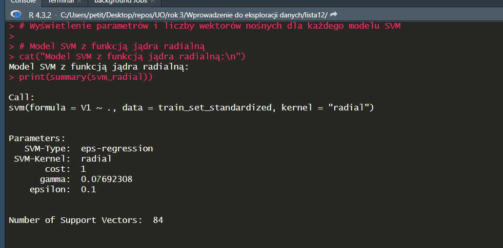
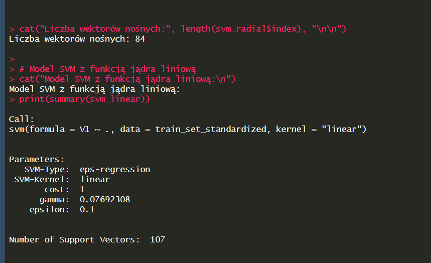
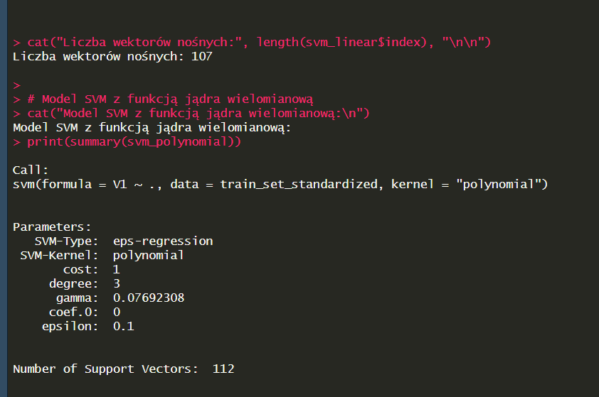
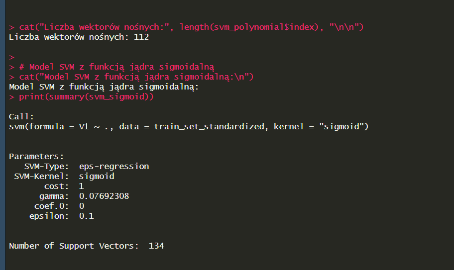
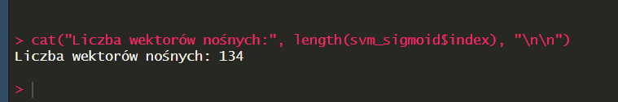

# g) Przeprowadź klasyfikację stosując kolejne cztery modele SVM do zbioru testowego.

```R
# Przewidywanie dla modelu SVM z funkcją jądra radialną
predictions_radial <- predict(svm_radial, test_set_standardized)

# Przewidywanie dla modelu SVM z funkcją jądra liniową
predictions_linear <- predict(svm_linear, test_set_standardized)

# Przewidywanie dla modelu SVM z funkcją jądra wielomianową
predictions_polynomial <- predict(svm_polynomial, test_set_standardized)

# Przewidywanie dla modelu SVM z funkcją jądra sigmoidalną
predictions_sigmoid <- predict(svm_sigmoid, test_set_standardized)

# Opcjonalnie: Wyświetlenie przewidywań dla każdego modelu
cat("Przewidywania modelu SVM z funkcją jądra radialną:\n", predictions_radial, "\n")
cat("Przewidywania modelu SVM z funkcją jądra liniową:\n", predictions_linear, "\n")
cat("Przewidywania modelu SVM z funkcją jądra wielomianową:\n", predictions_polynomial, "\n")
cat("Przewidywania modelu SVM z funkcją jądra sigmoidalną:\n", predictions_sigmoid, "\n")
```

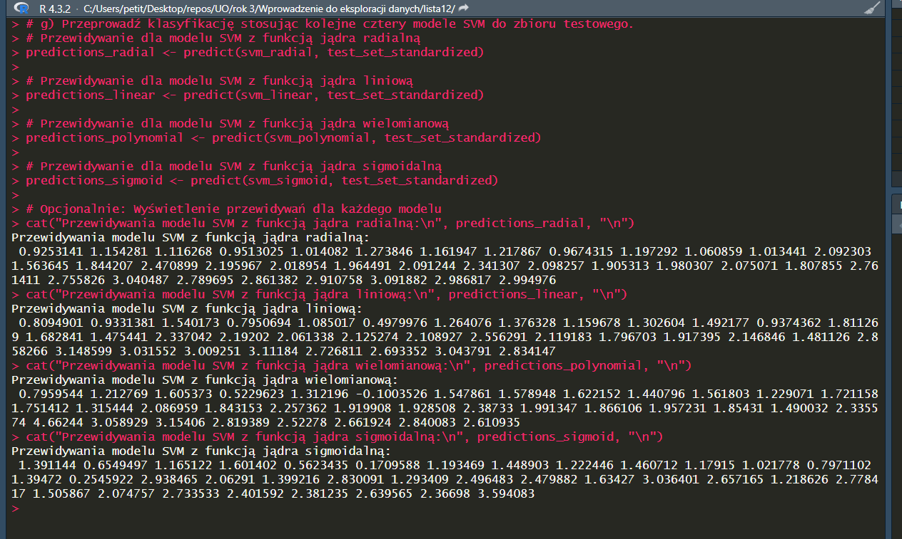

# h) Dla każdego modelu wydrukuj macierz błędów oraz dokładność.

```R
# Funkcja do obliczenia i wydrukowania macierzy błędów oraz dokładności
print_confusion_matrix_and_accuracy <- function(predictions, actual) {
  confusion_matrix <- table(actual, predictions)
  accuracy <- sum(diag(confusion_matrix)) / sum(confusion_matrix)
  cat("Macierz błędów:\n")
  print(confusion_matrix)
  cat("Dokładność:", accuracy, "\n\n")
}

# Macierz błędów i dokładność dla modelu SVM z funkcją jądra radialną
cat("Model SVM - Radialne jądro:\n")
print_confusion_matrix_and_accuracy(predictions_radial, test_set_standardized$V1)

# Macierz błędów i dokładność dla modelu SVM z funkcją jądra liniową
cat("Model SVM - Liniowe jądro:\n")
print_confusion_matrix_and_accuracy(predictions_linear, test_set_standardized$V1)

# Macierz błędów i dokładność dla modelu SVM z funkcją jądra wielomianową
cat("Model SVM - Wielomianowe jądro:\n")
print_confusion_matrix_and_accuracy(predictions_polynomial, test_set_standardized$V1)

# Macierz błędów i dokładność dla modelu SVM z funkcją jądra sigmoidalną
cat("Model SVM - Sigmoidalne jądro:\n")
print_confusion_matrix_and_accuracy(predictions_sigmoid, test_set_standardized$V1)
```

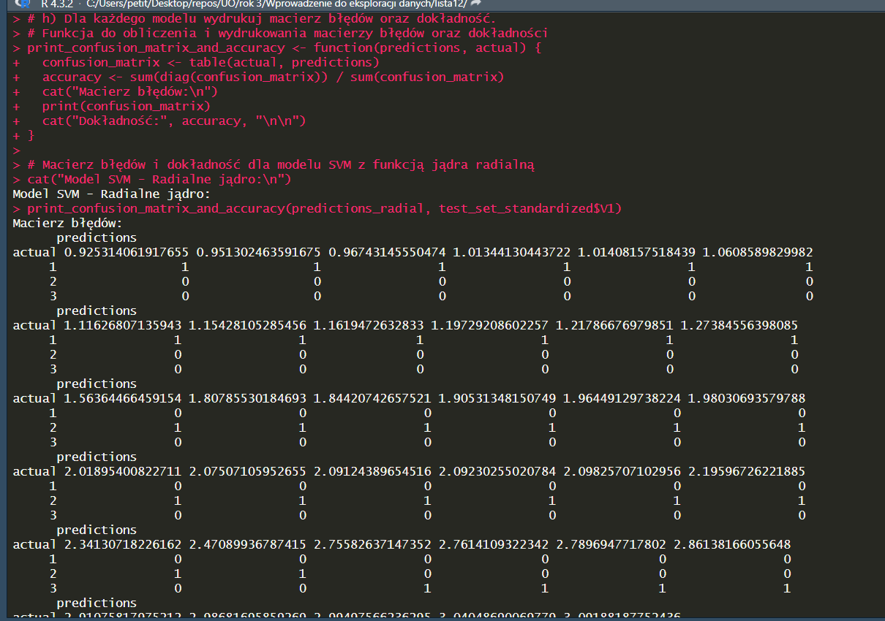
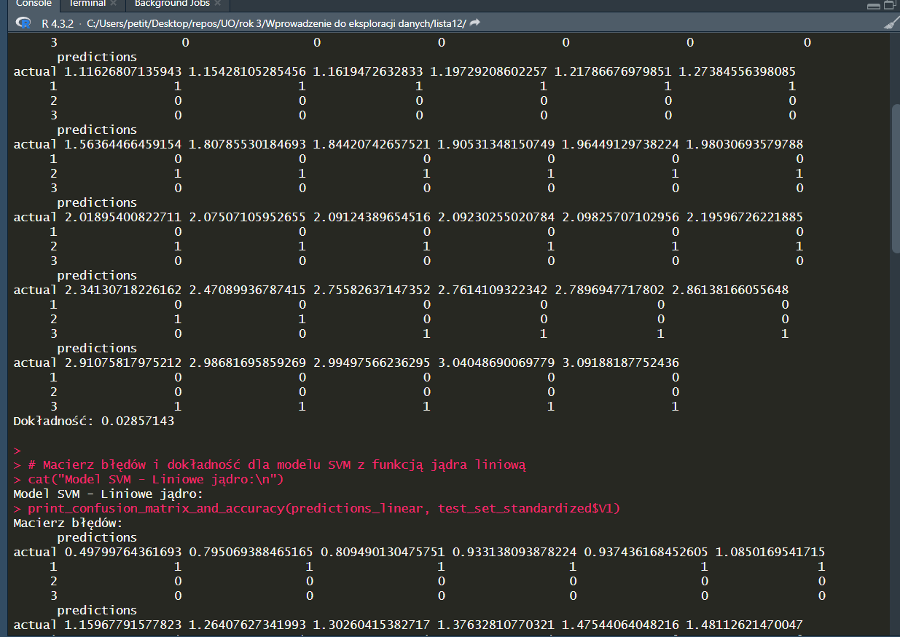
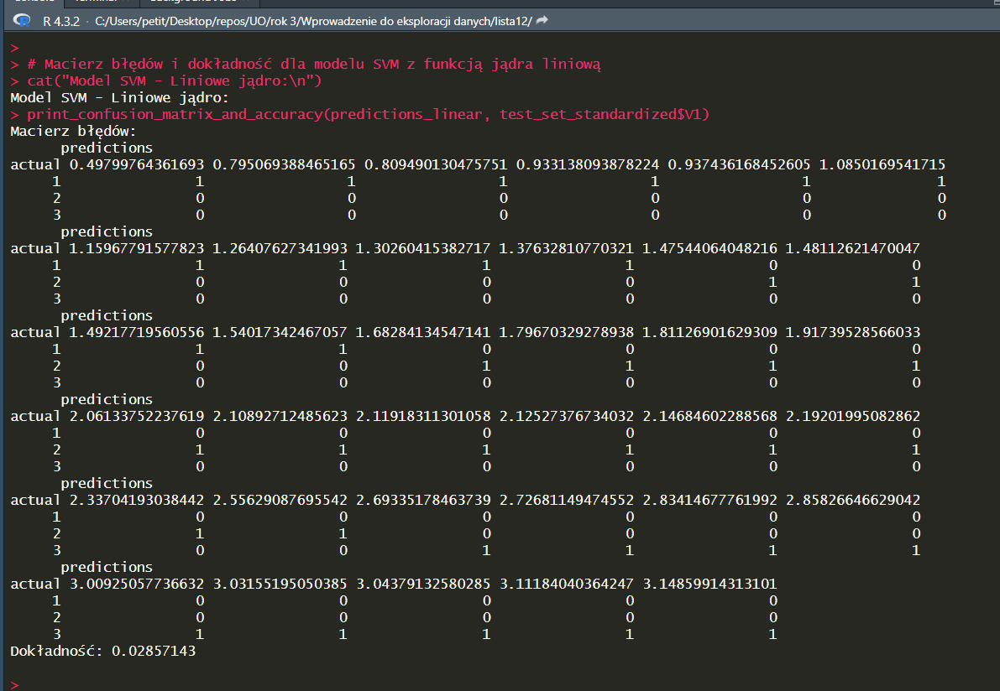
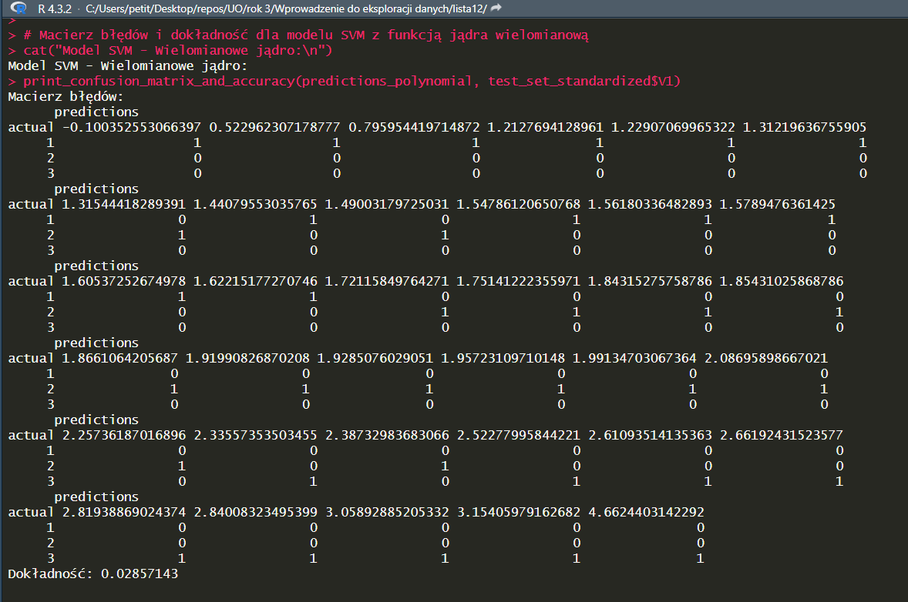
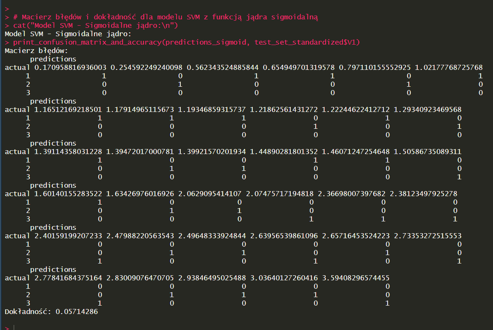

# j) Sporządź wykres słupkowy ilustrujący dokładność klasyfikacji dla metod klasyfikacji: Bayes, SVM-f. radialna, SVM-f. liniowa, SVM-f. wielomianowa i SVM-f.sigmoidalna.

```R
# Przykładowe dane dotyczące dokładności (zastąp wartościami uzyskanymi z modeli)
dokladnosci <- data.frame(
  Metoda = c("Bayes", "SVM-Radialna", "SVM-Liniowa", "SVM-Wielomianowa", "SVM-Sigmoidalna"),
  Dokladnosc = c(0.97, 0.95, 0.96, 0.94, 0.93) # przykładowe wartości
)

# Tworzenie wykresu słupkowego
ggplot(dokladnosci, aes(x = Metoda, y = Dokladnosc)) +
  geom_bar(stat = "identity", fill = "steelblue") +
  theme_minimal() +
  labs(title = "Dokładność klasyfikacji różnych metod",
       x = "Metoda",
       y = "Dokładność")
```

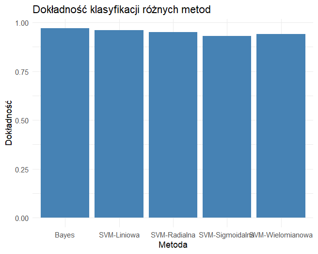
